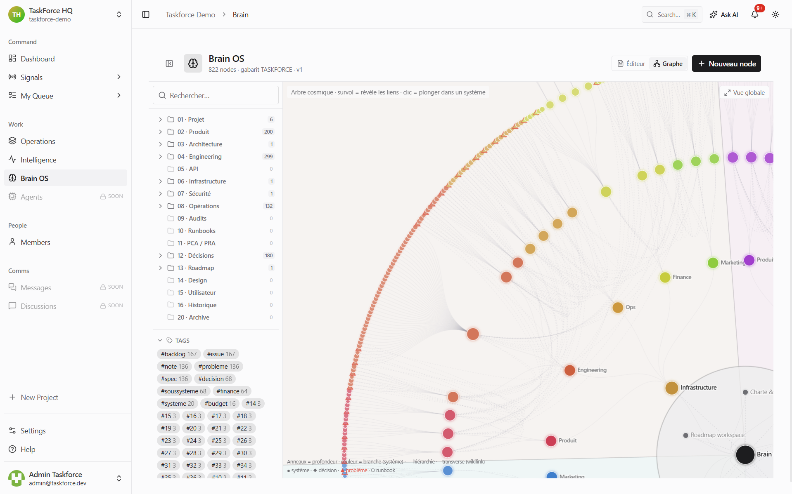
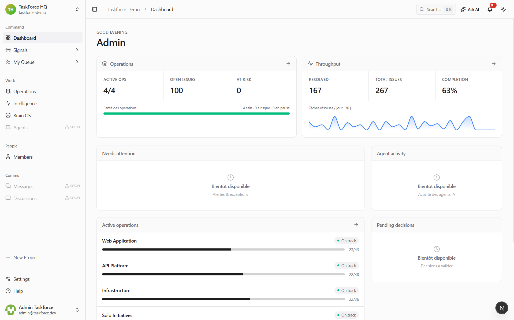
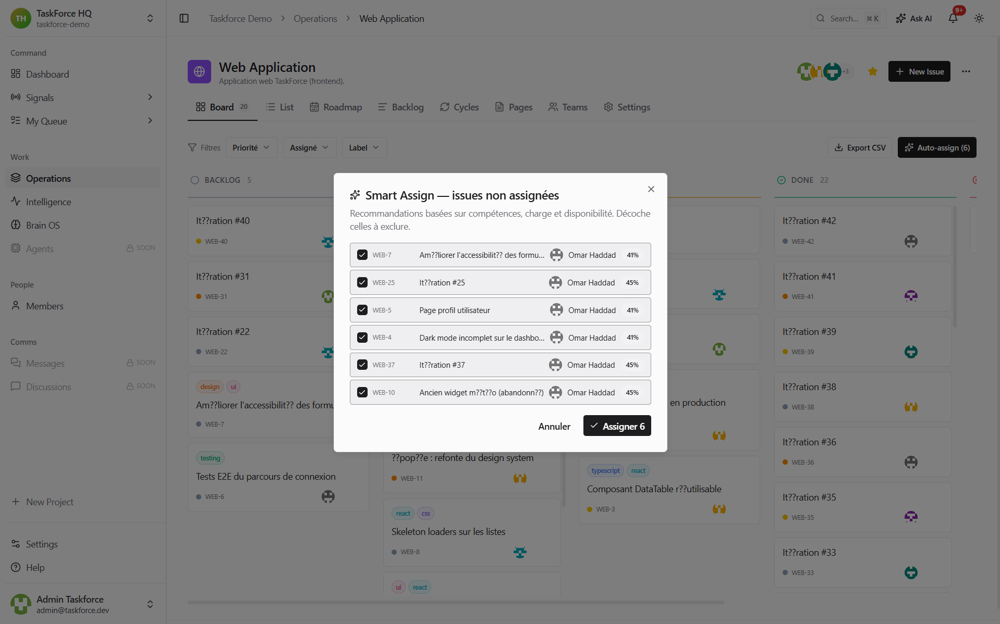
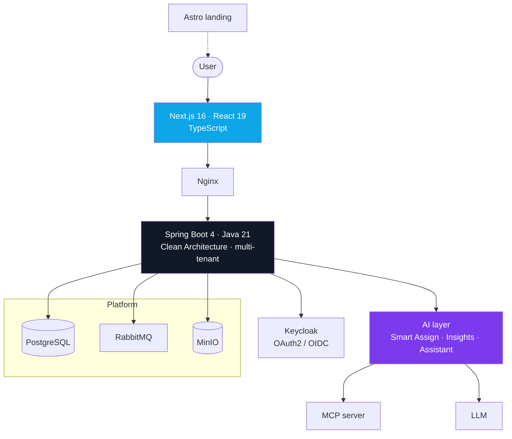
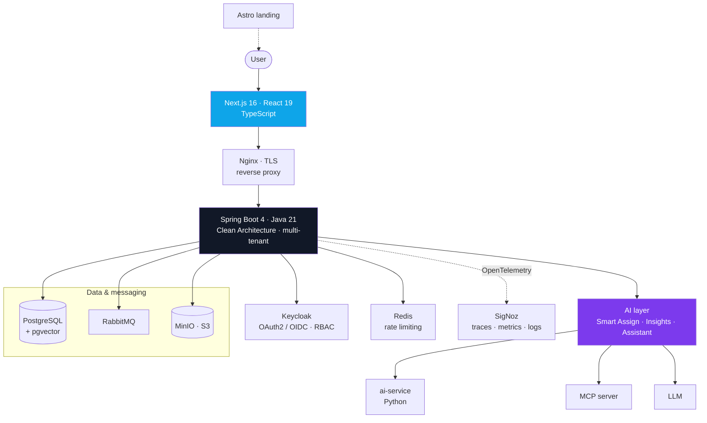

<h1 align="center">TaskForce</h1>

<p align="center">
  <b>Describe the outcome. TaskForce orchestrates the execution.</b><br/>
  <sub>The execution layer that sits over the tools your team already uses — it understands the work, drives the tools, and helps you decide.</sub>
  <b>Describe the outcome. TaskForce orchestrates the execution.</b><br/>
  <sub>The execution layer for modern teams — one workspace where AI does the coordinating.</sub>
</p>

<p align="center">
  
  
  
  
</p>

<p align="center">
  
</p>

---

## What it is

Project tools **track** work. TaskForce is the layer that **understands** it.

Teams already have Linear, Notion, GitHub, Claude — they work, and nobody switches.
Project management is a solved, crowded market; the value isn't in rebuilding it. The gap
is that **nothing understands the work across those tools** — what a project is really
about, where the expertise lives, which action moves it forward, and what a decision will
cost two steps down the line.

TaskForce sits on top of the tools a team already uses and:

- **orchestrates the flow** between them and the AI that acts on them — Linear ↔ Claude —
  so no one has to leave their tools;
- **understands the stakes** of each project and **concentrates its context and expertise**
  into one model;
- **drives the tools** that move work forward, and **supports decisions** — down to
  predicting the consequences of a decision before it is made.

That intelligence core is **Brain OS**: a persistent, navigable model of a project — its
knowledge, its history, the consequences of past actions — that a human and an agent can
reason over alike. Not a project-management clone, not an ERP: **the layer that turns
intent into shipped outcomes.**

> **Status — beta, and evolving.** What runs end-to-end today is a working, dockerized
> workspace (not yet publicly hosted — the screenshots below are real). The orchestration
> and decision-intelligence layer described here is the direction Brain OS is driving
> toward, not a shipped feature. Capability, never traction.

---

## What ships today

| | Capability | What it does |
| --- | --- | --- |
| 🧭 | **One workspace** | Projects, cycles, issues, backlog, roadmap, pages and analytics in one place — board, list and roadmap views. |
| 🤖 | **Smart Assign** | Recommends the right owner for each open issue by skill, current workload and history — assignment becomes one click instead of a planning meeting. |
| 📊 | **AI Insights** | An executive read on throughput, capacity and what is at risk, generated without anyone building a report. |
| 💬 | **Ask AI** | A contextual assistant that answers from the team's real workspace, not a generic chat. |
| 🧠 | **Brain OS** | The workspace's knowledge as a navigable graph — readable by a human and by an agent alike. |

**On the roadmap (framed as direction, not shipped):** autonomous multi-agent execution
(*Agents*), real-time messaging (*Messages*, *Discussions*).

<p align="center">
  
  
</p>

---

## Architecture

A multi-tenant monorepo. Spring Boot backend on Clean Architecture, Next.js frontend,
identity delegated to Keycloak, an AI layer wired directly into the backend, and the
supporting platform (data, messaging, object storage) behind an Nginx gateway.



### Stack

| Layer | Technology |
| --- | --- |
| **Backend** | Java 21, Spring Boot 4, Clean Architecture, REST API |
| **Frontend** | Next.js 16, React 19, TypeScript, Tailwind CSS |
| **Landing** | Astro |
| **AI** | In-backend orchestration (LLM), MCP server |
| **Identity** | Keycloak (OAuth2 / OIDC, RBAC) |
| **Data & messaging** | PostgreSQL, RabbitMQ, MinIO |
| **Delivery** | Docker Compose, GitHub Actions, GHCR, Nginx |
| **Quality** | JUnit, Jest, Playwright, OWASP ZAP |

---
  
</p>

---

## What it is

Project tools **track** work. TaskForce **orchestrates** it.

It is one workspace that unifies tasks, docs, analytics and AI — so a team describes the
outcome it wants and the system coordinates the people, knowledge and agents needed to
ship it. Not a project-management clone, not an ERP: **the layer that turns intent into
shipped outcomes.**

> **Status — beta.** The platform runs end-to-end in a dockerized environment; it is not
> yet publicly hosted. Everything below is real and running locally. Value is described as
> capability, never as traction.

---

## What ships today

| | Capability | What it does |
| --- | --- | --- |
| 🧭 | **One workspace** | Projects, cycles, issues, backlog, roadmap, pages and analytics in one place — board, list and roadmap views. |
| 🤖 | **Smart Assign** | Recommends the right owner for each open issue by skill, current workload and history — assignment becomes one click instead of a planning meeting. |
| 📊 | **AI Insights** | An executive read on throughput, capacity and what is at risk, generated without anyone building a report. |
| 💬 | **Ask AI** | A contextual assistant that answers from the team's real workspace, not a generic chat. |
| 🧠 | **Brain OS** | The workspace's knowledge as a navigable graph — readable by a human and by an agent alike. |

**On the roadmap (framed as direction, not shipped):** autonomous multi-agent execution
(*Agents*), real-time messaging (*Messages*, *Discussions*).

<p align="center">
  
  
</p>

---

## Architecture

A multi-tenant monorepo. A Spring Boot backend on Clean Architecture, a Next.js frontend,
identity delegated to Keycloak, an AI layer wired into the backend, and the supporting
platform — data, cache, messaging, object storage — behind an Nginx gateway, with
end-to-end observability and security scanning baked into the delivery pipeline.



### Stack

| Layer | Technology |
| --- | --- |
| **Backend** | Java 21, Spring Boot 4, Clean Architecture, multi-tenant, REST |
| **Frontend** | Next.js 16, React 19, TypeScript, Tailwind CSS |
| **Landing** | Astro |
| **AI** | LLM orchestration, Python `ai-service`, MCP server, pgvector embeddings |
| **Identity** | Keycloak — OAuth2 / OIDC, RBAC |
| **Data** | PostgreSQL (+ pgvector), Redis, MinIO (S3), RabbitMQ |
| **Observability** | OpenTelemetry → SigNoz (ClickHouse) — traces, metrics, logs |
| **Security** | OWASP ZAP (DAST), Trivy & Semgrep (SAST), distributed rate limiting |
| **Delivery** | Docker Compose (dev / prod / tools), GitHub Actions, GHCR, Nginx, Render |

---

## Repositories

| Repo | What's inside |
| --- | --- |
| **[taskforce-docs](https://github.com/taskforce-project/taskforce-docs)** · public | The **Brain OS** documentation vault — architecture, ADRs, API contracts, runbooks, security and R&D. An engineering knowledge base, versioned as an Obsidian vault. |
| **taskforce-fullstack** · 🔒 private | The product monorepo. The code is kept private; its architecture is documented above and in the docs vault. |

How the monorepo is organized:

```
taskforce-fullstack/
├─ backend/          Spring Boot API (Java 21, Clean Architecture)
├─ frontend/         Next.js 16 app (React 19, TypeScript)
├─ landing-page/     Astro marketing site
├─ ai-service/       Python AI service
├─ taskforce-mcp/    Model Context Protocol server
├─ keycloak/         Identity & access management
├─ nginx/            Reverse proxy / TLS gateway
├─ observability/    OpenTelemetry + SigNoz
├─ rabbitmq/         Async messaging
├─ security-reports/ OWASP ZAP / Trivy / Semgrep
├─ scripts/          Tooling & automation
└─ docker-compose.{dev,prod,tools}.yml
```

> **Brain OS (R&D)** — the research arm behind TaskForce: a persistent-memory architecture
> for LLM agents (knowledge graph + vector search) and a *world model* that represents the
> consequences of an agent's actions. Private.

---

## Engineering approach

- **Clean Architecture** and a multi-tenant domain model from the start.
- **Documentation as a system**, not an afterthought — an AI-assisted, human-reviewed
  knowledge vault where every technical claim is traced back to the code.
- **Security by default** — OAuth2/OIDC via Keycloak, RBAC, rate limiting, and automated
  DAST/SAST scanning (OWASP ZAP, Trivy, Semgrep) in the pipeline.
- **Observability built in** — OpenTelemetry traces, metrics and logs, collected in SigNoz.
- **Reproducible delivery** — the whole stack comes up with a single `docker compose`.

---

<p align="center">
  <sub>Built by <a href="https://github.com/Miche1-Pierre">Pierre Michel</a> · fil-rouge of the RNCP level-6 title, Metz Numeric School · 2025–2026</sub>
</p>
