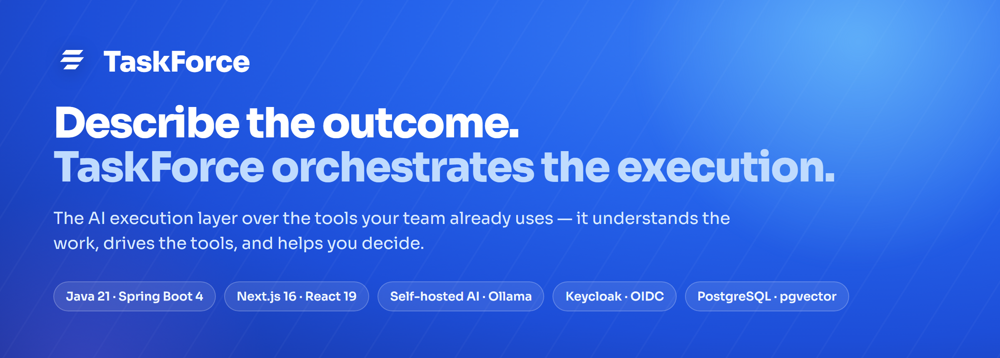
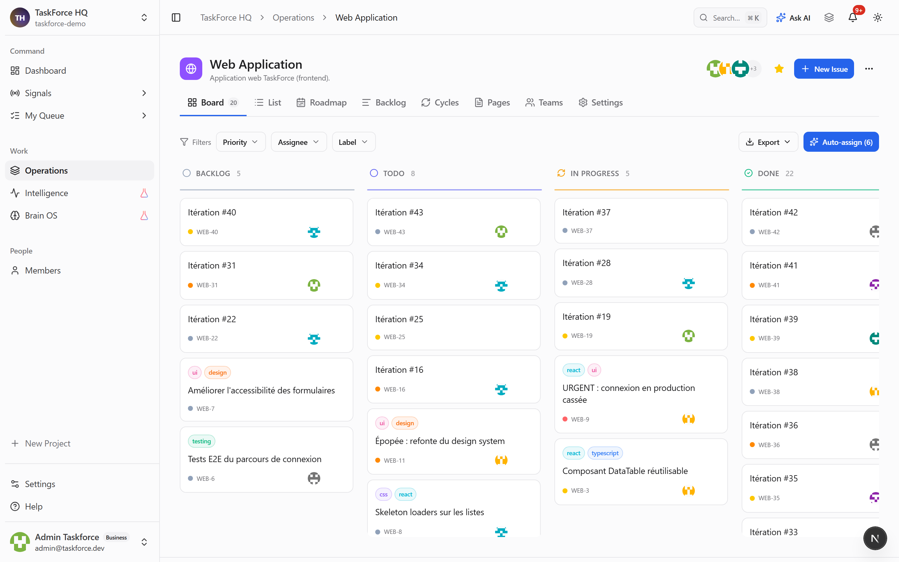
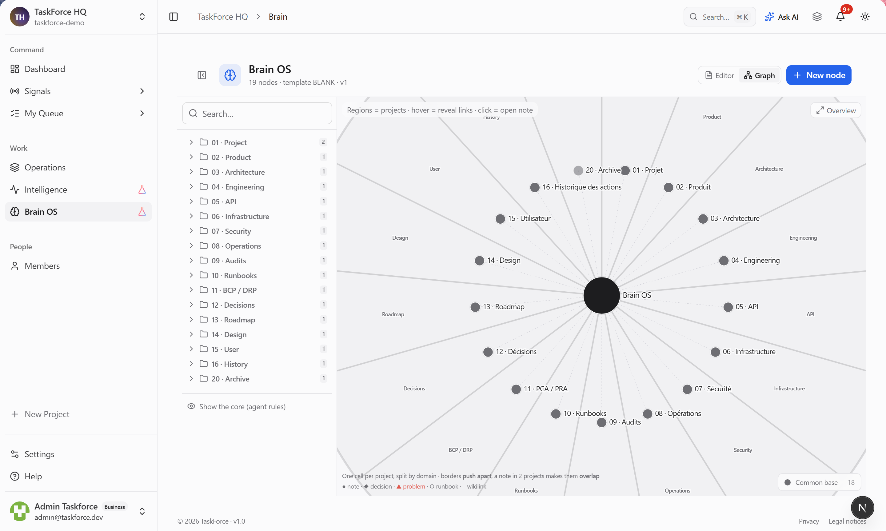
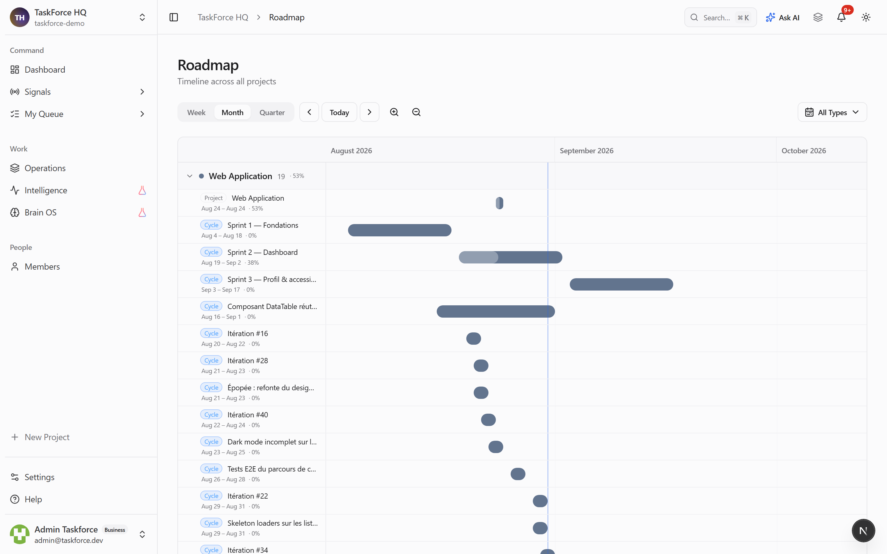
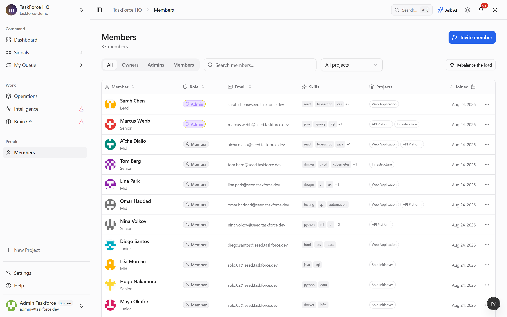
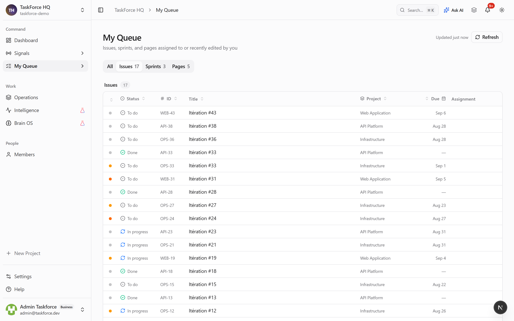
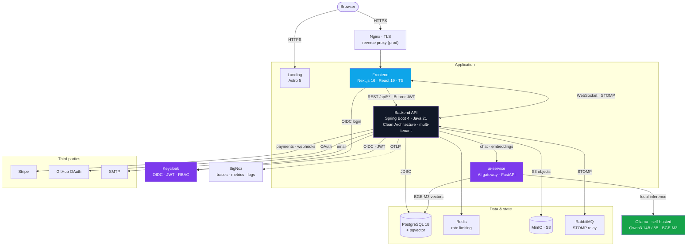
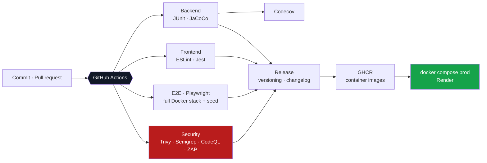
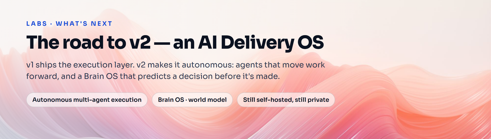
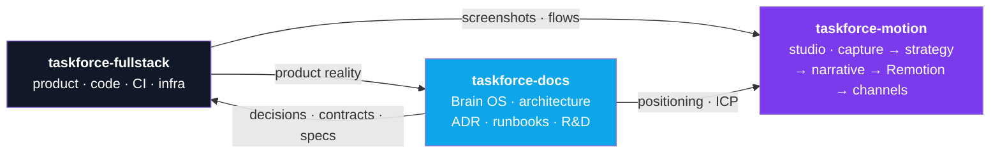

<br />

<p align="center">
  
</p>

<p align="center"><b>The AI execution layer for teams that ship.</b></p>

<p align="center">
  <a href="https://taskforce-project.fr"><b>Website</b></a> •
  <a href="https://app.taskforce-project.fr"><b>Live app</b></a> •
  <a href="https://github.com/taskforce-project/taskforce-docs"><b>Documentation</b></a>
</p>

<p align="center">
  
  
  
  
  
</p>

<p align="center">
  
</p>

Meet **TaskForce** — the layer that sits on top of the tools a team already uses (Linear,
Notion, GitHub, Claude) and turns intent into shipped outcomes. Project tools *track* work;
TaskForce is the layer that *understands* it.

The market is solved and crowded, and nobody switches — so the value isn't in rebuilding a
project manager. The gap is that **nothing understands the work across those tools**: what a
project is really about, where the expertise lives, which action moves it forward, and what
a decision will cost two steps down the line. TaskForce **orchestrates the flow** between a
team's tools and the AI that acts on them, **concentrates each project's context** into one
model, and **supports decisions** — down to predicting their consequences before they're made.

That intelligence core is **Brain OS**: a persistent, navigable model of a project — its
knowledge, its history, the consequences of past actions — that a human and an agent can
reason over alike.

> **Status — beta, and evolving.** What runs end-to-end today is a working, dockerized
> workspace, deployed and reachable — the screenshots below are real. The full orchestration
> and decision-intelligence layer is the direction Brain OS is driving toward, not a shipped
> feature. Capability, never traction.

---

## 🌟 What ships today

| | Capability | What it does |
| --- | --- | --- |
| 🧭 | **One workspace** | Projects, cycles, issues, backlog, roadmap, pages and analytics in one place — board, list and roadmap views. |
| 🤖 | **Smart Assign** | Recommends the right owner for each open issue by skill, current workload and history — a transparent, decomposed score instead of a planning meeting. |
| 📊 | **AI Insights** | An executive read on throughput, capacity and what is at risk, generated without anyone building a report. |
| 💬 | **Ask AI** | A contextual assistant that answers from the team's real workspace, not a generic chat. |
| 🧠 | **Brain OS** | The workspace's knowledge as a navigable graph — readable by a human and by an agent alike. |

---

## 📸 Screenshots

<p align="center">
  
</p>
<p align="center"><sub><b>Board</b> — backlog, cycles and issues across a project, Smart Assign one click away.</sub></p>

<br />

<p align="center">
  
</p>
<p align="center"><sub><b>Brain OS</b> — the workspace knowledge as a navigable graph, readable by a human and an agent alike.</sub></p>

<br />

<p align="center">
  
</p>
<p align="center"><sub><b>Roadmap</b> — cycles and delivery across time, all projects on one timeline.</sub></p>

<br />

<p align="center">
  
</p>
<p align="center"><sub><b>Members</b> — roles, skills and real workload balance — the profile that powers Smart Assign.</sub></p>

<br />

<p align="center">
  
</p>
<p align="center"><sub><b>My work</b> — every issue, sprint and page assigned to or recently edited by you.</sub></p>

---

## 🏗️ System architecture

A multi-tenant monorepo. Identity is delegated to Keycloak; the frontend talks to the API
over REST with a bearer JWT for commands and over **WebSocket/STOMP** for anything
real-time, with RabbitMQ acting as the STOMP relay. **Inference is self-hosted**: the API
talks to an AI gateway that routes to a local Ollama runtime — no third-party LLM, no data
leaving the machine. Every request is traced end-to-end through OpenTelemetry.



### Stack

| Layer | Technology |
| --- | --- |
| **Backend** | Java 21, Spring Boot 4, Clean Architecture, multi-tenant, REST + WebSocket/STOMP |
| **Frontend** | Next.js 16, React 19, TypeScript, Tailwind CSS |
| **Landing** | Astro 5 |
| **AI** | Self-hosted inference — Ollama running **Qwen3 14B / 8B**, **BGE-M3** embeddings (1024d) in pgvector, behind a FastAPI gateway with fast / standard / deep routing tiers; MCP server |
| **Identity** | Keycloak — OIDC, JWT, RBAC |
| **Data** | PostgreSQL 18 + pgvector, Redis, MinIO (S3), RabbitMQ (STOMP relay) |
| **Third parties** | Stripe, GitHub OAuth (Google planned), SMTP |
| **Observability** | OpenTelemetry → SigNoz (ClickHouse) |
| **Security** | OWASP ZAP (DAST), Trivy & Semgrep (SAST), CodeQL, distributed rate limiting |
| **Delivery** | Docker Compose (dev / prod / tools), GitHub Actions, GHCR, Nginx, Render |

---

## 🚀 Delivery pipeline

Every pull request runs the full quality gate — including **end-to-end tests against a
real Docker stack**, not mocks.



---

<p align="center">
  
</p>

## 🔭 What's next

TaskForce v1 ships the **execution layer**. v2 turns it **autonomous** — an evolution, not a
rewrite: the AI engine is already ~80% Java, and the same self-hosted inference drives it.

- **Autonomous execution** — the orchestration layer stops suggesting and starts doing:
  multi-agent runs that open PRs, update issues and move work forward under human review.
- **Brain OS, Phase 4** — from a navigable knowledge graph to a *world model*: simulate the
  consequences of a decision two steps ahead, before anyone commits to it.
- **Still self-hosted, still private** — the same local Ollama inference, now driving the
  loop end to end. No data leaves the machine.

> Direction, not a shipped feature. The v2 specs and R&D live in the
> [docs vault](https://github.com/taskforce-project/taskforce-docs).

---

## 🔁 How the project is run

Three repositories, one loop: the product generates reality, the knowledge base captures
and challenges it, and the studio turns it into narrative.



---

## 📦 Repositories

| Repo | What's inside |
| --- | --- |
| **[taskforce-docs](https://github.com/taskforce-project/taskforce-docs)** · public | The **Brain OS** documentation vault — architecture (incl. C4 and UML), ADRs, API contracts, data model, runbooks, security and R&D. An engineering knowledge base, versioned as an Obsidian vault. |
| **taskforce-fullstack** · 🔒 private | The product monorepo. The code is kept private; its architecture is documented above and in the docs vault. |
| **taskforce-motion** · 🔒 private | **TaskForce Studio** — a marketing and motion OS, not a Remotion project: product capture feeds strategy, strategy drives narrative, Remotion is only the execution engine. No asset without a marketing hypothesis. |

How the monorepo is organized:

```
taskforce-fullstack/
├─ backend/          Spring Boot API (Java 21, Clean Architecture)
├─ frontend/         Next.js 16 app (React 19, TypeScript)
├─ landing-page/     Astro marketing site
├─ ai-service/       AI gateway (FastAPI) → local Ollama runtime
├─ taskforce-mcp/    Model Context Protocol server
├─ keycloak/         Identity & access management
├─ nginx/            Reverse proxy / TLS gateway
├─ observability/    OpenTelemetry + SigNoz
├─ rabbitmq/         STOMP relay for realtime
├─ security-reports/ OWASP ZAP / Trivy / Semgrep
├─ scripts/          Tooling & automation
└─ docker-compose.{dev,prod,tools}.yml
```

---

## 🧭 Engineering approach

- **Clean Architecture** and a multi-tenant domain model from the start.
- **Documentation as a system**, not an afterthought — an AI-assisted, human-reviewed
  knowledge vault where every technical claim is traced back to the code, and divergence
  between docs and code is flagged rather than hidden.
- **Security by default** — OIDC/JWT via Keycloak, RBAC, distributed rate limiting, and
  automated DAST/SAST scanning (OWASP ZAP, Trivy, Semgrep, CodeQL).
- **Self-hosted AI** — inference runs on a local Ollama runtime, so workspace content is
  never sent to a third-party model provider.
- **Observability built in** — OpenTelemetry traces, metrics and logs, collected in SigNoz.
- **Tested against reality** — E2E runs Playwright against the full dockerized stack.
- **Reproducible delivery** — the whole stack comes up with a single `docker compose`.

---

## ⚙️ Built with

[](https://openjdk.org/)
[](https://spring.io/projects/spring-boot)
[](https://nextjs.org/)
[](https://react.dev/)
[](https://www.typescriptlang.org/)
[](https://www.postgresql.org/)
[](https://www.keycloak.org/)
[](https://www.docker.com/)

---

<p align="center">
  <sub>Built by <a href="https://github.com/Miche1-Pierre">Pierre Michel</a> · fil-rouge of the RNCP level-6 title, Metz Numeric School · 2025–2026</sub>
</p>
